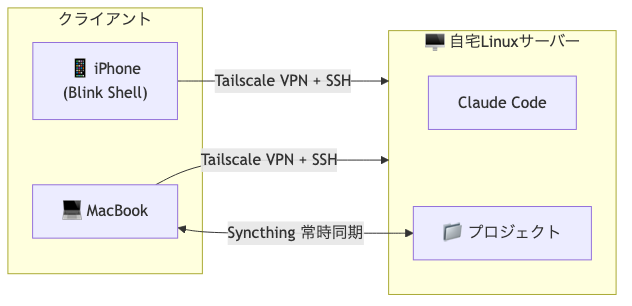

# iPhoneからClaude Code（CLI版）を使う自宅サーバー構築

iPhoneからローカル版Claude Codeにアクセスするための自宅サーバー構築ガイド

## 構成

## ドキュメント

- [server-setup-log.md](server-setup-log.md) - セットアップ手順
- [quick-reference.md](quick-reference.md) - よく使うコマンド集

## 使用ツール

- Ubuntu Server
- Tailscale（VPN）
- Syncthing（ファイル同期）
- Claude Code
- Blink Shell（iPhoneアプリ）
